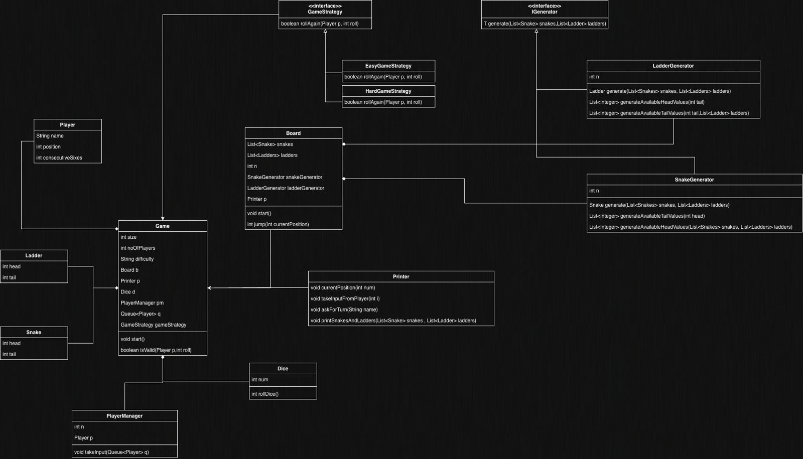

# Snake and Ladder — Low Level Design

A console-based **Snake and Ladder** game built in Java, demonstrating core Object-Oriented Design principles including **Strategy Pattern**, **Generics**, and **Separation of Concerns**.

---

## UML Class Diagram



---

## Project Structure

| File | Responsibility |
|---|---|
| `Main.java` | Entry point — configures and starts a game |
| `Game.java` | Core game loop — manages turns, dice rolls, and win condition |
| `Board.java` | Holds snakes & ladders, handles position jumps |
| `Player.java` | Player model — name, position, consecutive sixes |
| `Dice.java` | Random dice roll (1–6) |
| `PlayerManager.java` | Takes player name input and populates the queue |
| `Printer.java` | All console output (prompts, results, board state) |
| `Snake.java` | Snake entity — head (high) → tail (low) |
| `Ladder.java` | Ladder entity — tail (low) → head (high) |
| `IGenerator<T>` | Generic interface for generating board elements |
| `SnakeGenerator.java` | Generates snakes with valid, non-overlapping positions |
| `LadderGenerator.java` | Generates ladders with valid, non-overlapping positions |
| `GameStrategy.java` | Strategy interface — decides if a player rolls again |
| `EasyGameStrategy.java` | Easy mode — roll again on a 6, no penalty |
| `HardGameStrategy.java` | Hard mode — roll again on a 6, but 3 consecutive sixes cancels the turn |

---

## Key Design Patterns

### Strategy Pattern
The `GameStrategy` interface decouples the "roll again" rule from the game loop. Two concrete strategies are provided:

- **`EasyGameStrategy`** — Player gets another roll on a 6. No upper limit.
- **`HardGameStrategy`** — Player gets another roll on a 6, but 3 consecutive sixes resets the turn (player doesn't move).

Swapping difficulty is as simple as passing a different strategy to the `Game` constructor.
---

## Game Rules

1. Players start at **position 1** on an `n × n` board (default `10 × 10 = 100`).
2. Players take turns rolling a 6-sided dice by pressing **Enter**.
3. If a player lands on a **snake's head**, they slide down to its tail.
4. If a player lands on a **ladder's tail**, they climb up to its head.
5. Cascading jumps are supported — landing on a snake's tail that is also a ladder's tail triggers a chain.
6. A player must land **exactly** on the last square to win; overshooting is an invalid move.
7. The first player to reach position `n × n` wins and is removed from the queue.

---

## Running Instructions

### Prerequisites
- **Java JDK 8+** installed
- A terminal / command prompt

### Compile

```bash
# From the parent directory of SnakeAndLadder/
javac SnakeAndLadder/*.java
```

### Run

```bash
# From the parent directory of SnakeAndLadder/
java SnakeAndLadder.Main
```

--

## Sample Interaction

```
Player No: 0 enter your name
Alice
Player No: 1 enter your name
Bob
Alice press enter to roll the dice

Alice rolled a 4
--- Snakes ---
S(87->14) S(62->3) S(95->30)
--- Ladders ---
L(8->52) L(23->67) L(41->79)
----------------
 your current position is 5
Bob press enter to roll the dice

Bob rolled a 6
--- Snakes ---
S(87->14) S(62->3) S(95->30)
--- Ladders ---
L(8->52) L(23->67) L(41->79)
----------------
Bob press enter to roll the dice

Bob rolled a 3
--- Snakes ---
S(87->14) S(62->3) S(95->30)
--- Ladders ---
L(8->52) L(23->67) L(41->79)
----------------
 your current position is 10
Alice press enter to roll the dice

Alice rolled a 3
--- Snakes ---
S(87->14) S(62->3) S(95->30)
--- Ladders ---
L(8->52) L(23->67) L(41->79)
----------------
You climbed by ladder at position 8
 your current position is 52
...
Congratulations! Alice won the game!
```

